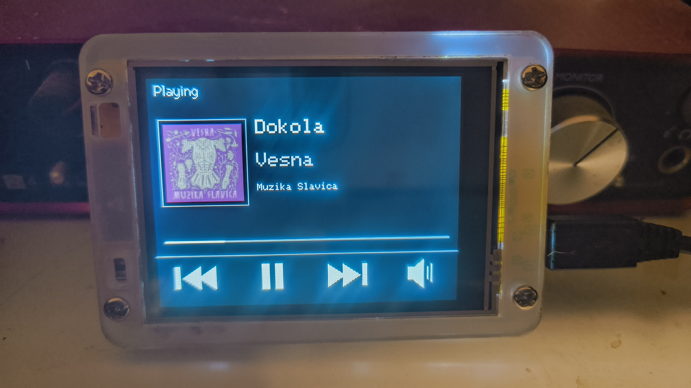
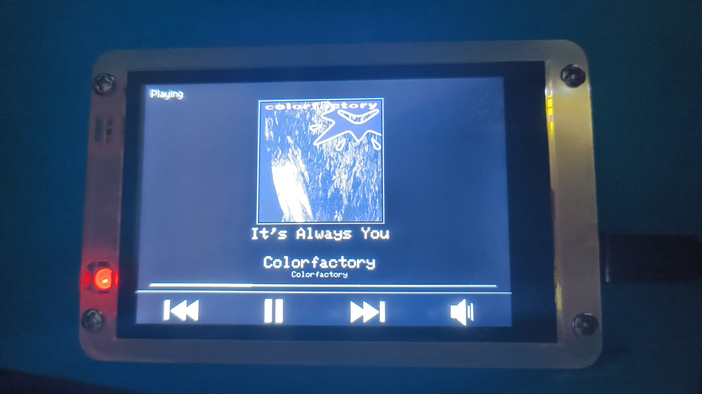

# CYD Home Assistant Media Remote

An ESP32 touch-screen remote for a Home Assistant `media_player` entity (Spotify, Sonos, anything with media attributes). Shows the current track with cover art and lets you control playback right from the display.

| ESP32-2432S028R (2.8") | ESP32-3248S035C (3.5") |
|---|---|
|  |  |

## Features

- **Live updates over WebSocket** — subscribes to the Home Assistant WebSocket API (server-side filtered triggers, including attribute changes), so track changes appear instantly; REST polling remains as a fallback safety net
- **Cover art** of any size — JPEG is decoded straight from the HTTP stream (~4 kB workspace, no filesystem, no size limit)
- **Touch controls**: previous / play-pause / next / volume modal (tap-and-hold repeats), tap the progress bar to seek
- **Progress bar** extrapolated from `media_position` + `media_position_updated_at` (NTP-synced), so it stays accurate between updates
- **Diacritics-safe text** — UTF-8 titles are transliterated to ASCII (č→c, ř→r, …) for the bitmap fonts
- **Auto-dimming backlight** — full brightness while playing or after a touch, dimmed when idle
- **WiFiManager captive portal** for all configuration (no secrets in the source)
- **OTA updates** after the first USB flash
- Robust reconnect handling for both Wi-Fi and the WebSocket

## Supported boards

| Board | Display | Touch | PlatformIO env | Where to buy |
|---|---|---|---|---|
| **ESP32-2432S028R** — "Cheap Yellow Display" (2.8", 320×240) | ILI9341 | XPT2046 (resistive) | `cyd` (or `cyd2usb` for the USB-C variant with inverted colors) | [AliExpress](https://www.aliexpress.com/item/1005007774435209.html) |
| **ESP32-3248S035C** (3.5", 480×320) | ST7796 | GT911 (capacitive) | `esp32_3248s035c` | [AliExpress](https://www.aliexpress.com/item/1005008624700714.html) |

Not sure which 2.8" variant you have? Flash `cyd` first; if colors look inverted (white background instead of black), use `cyd2usb`.

Diagnostic firmwares are available for troubleshooting: `diag` / `diag_esp32_3248s035c` (display color cycle) and `touchdiag_esp32_3248s035c` (GT911 touch test).

## Getting started

### 1. Get a Home Assistant token

In Home Assistant: **your profile (bottom left) → Security → Long-lived access tokens → Create token**. Copy the token value — it is shown only once. Do not include the word `Bearer`, just the token itself.

### 2. Flash the firmware

Install [PlatformIO](https://platformio.org/install/cli), connect the board via USB, then:

```sh
# 2.8" CYD
pio run -e cyd -t upload

# 3.5" board
pio run -e esp32_3248s035c -t upload
```

### 3. Configure via the captive portal

On first boot the device starts a Wi-Fi access point:

- **SSID:** `CYD-HA-Media`
- **Password:** `cydmedia`

Connect to it and the portal opens automatically (or visit `http://192.168.4.1`). Fill in:

| Field | Example |
|---|---|
| Wi-Fi network + password | your home Wi-Fi |
| HA URL | `http://homeassistant.local:8123` |
| HA token | the long-lived token from step 1 |
| media_player entity | `media_player.spotify_your_name` |

The configuration is stored on the device (LittleFS). To reopen the portal later, hold the **BOOT** button while pressing reset.

HTTPS URLs work too (certificate verification is disabled); plain HTTP on a trusted LAN is simpler and recommended.

### 4. OTA updates (optional)

After the first USB flash you can update over Wi-Fi. Add an OTA environment to `platformio.ini` (adjust the IP to your device — it is shown on the display at boot):

```ini
[env:esp32_3248s035c_ota]
extends = env:esp32_3248s035c
upload_protocol = espota
upload_port = 192.168.2.139
upload_flags = --auth=cydmedia
```

Then: `pio run -e esp32_3248s035c_ota -t upload`. The OTA password equals the AP password (`AP_PASSWORD` in `src/main.cpp`).

## Faster updates for external changes (recommended)

Home Assistant's Spotify integration polls the Spotify Web API roughly every 30 s, so track changes made **outside** HA (on your PC or phone) reach the display with up to 30 s delay. Changes made through HA or the remote itself are instant. To shorten the delay, add this automation in HA (Settings → Automations → new, edit in YAML):

```yaml
alias: "Spotify - frequent state refresh"
description: "Speeds up the CYD display's reaction to changes made outside HA"
trigger:
  - platform: time_pattern
    seconds: "/5"
condition:
  - condition: state
    entity_id: media_player.spotify_your_name
    state: playing
action:
  - service: homeassistant.update_entity
    target:
      entity_id: media_player.spotify_your_name
mode: single
```

## How it works

- On boot the device connects to Wi-Fi, syncs NTP (UTC, needed for progress extrapolation) and fetches the initial state over REST (`/api/states/<entity>`).
- It then opens a WebSocket to `/api/websocket`, authenticates with the token and sends `subscribe_trigger` with state triggers for the entity **and** its `media_title`, `media_position` and `volume_level` attributes (a plain state trigger ignores attribute-only changes — that's why the extra triggers are needed).
- While the WebSocket is healthy, REST polling drops to a 60 s safety interval; on disconnect it falls back to 3 s until the socket reconnects.
- State JSON is parsed with an ArduinoJson filter (Spotify entities carry a huge `source_list` that would otherwise blow the buffer).
- Cover art (`entity_picture`) is fetched from HA and decoded with the low-level tjpgd API directly from the HTTP stream. The auth token is only ever sent to the configured HA host, never to external image CDNs.

## Development

```sh
python3 -m pip install -r requirements-dev.txt

pio run                        # build the default env (cyd)
pio run -e esp32_3248s035c     # build for the 3.5" board
pio device monitor             # serial console, 115200 baud
```

Before committing, run the same complete build matrix as CI:

```sh
pio run -e cyd -e cyd2usb -e diag -e esp32_3248s035c -e diag_esp32_3248s035c -e touchdiag_esp32_3248s035c
```

The six environments cover both production board variants and all diagnostic
firmwares. Dependency updates should be made separately from feature changes,
then verified with the full build matrix and a smoke test on both physical
boards.

Everything lives in `src/main.cpp`; the board-specific layout constants are at the top of the main firmware section, guarded by `PANEL_*` defines. Diagnostic firmwares are selected with the `DIAGNOSTIC_TFT` / `DIAGNOSTIC_GT911` build flags (see `platformio.ini`).

Notes for contributors:

- `lib_ldf_mode = deep` is required — the WebSockets library isn't found by `deep+`.
- `board_build.partitions = min_spiffs.csv` gives the app 1.9 MB (needed) and keeps a small LittleFS for the config file. Changing the partition table wipes the stored configuration.
- TFT_eSPI is configured entirely through build flags (`-DUSER_SETUP_LOADED`), no `User_Setup.h` editing needed.

## Implementation log

- **Plan 001 — reproducible build gate:** pinned PlatformIO Core, the ESP32
  platform and all external libraries to the versions verified by the audit;
  added a six-environment GitHub Actions build matrix and documented its exact
  local equivalent. Hardware behavior was not changed by this plan.
